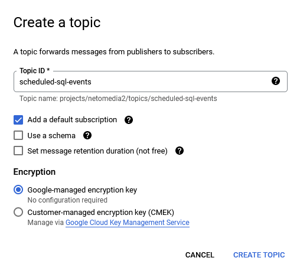
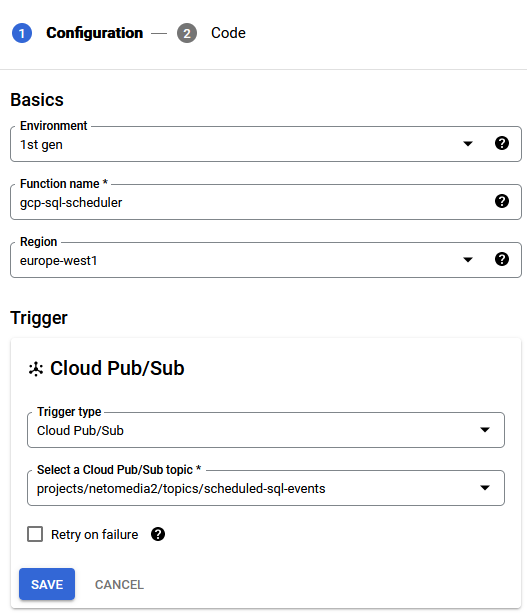
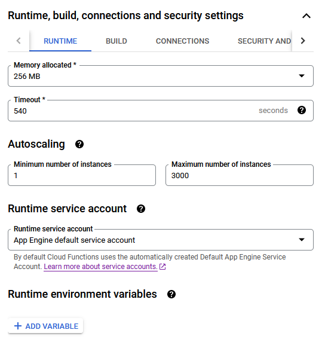
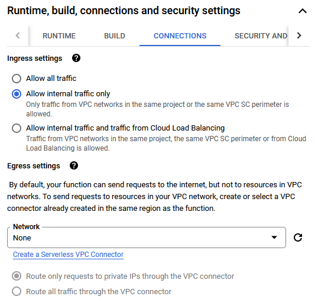
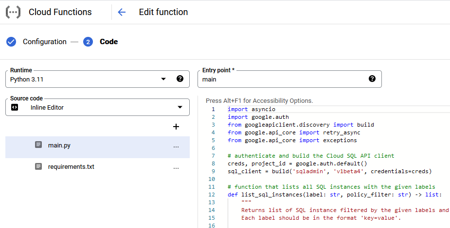
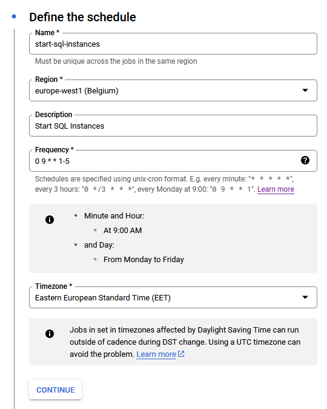
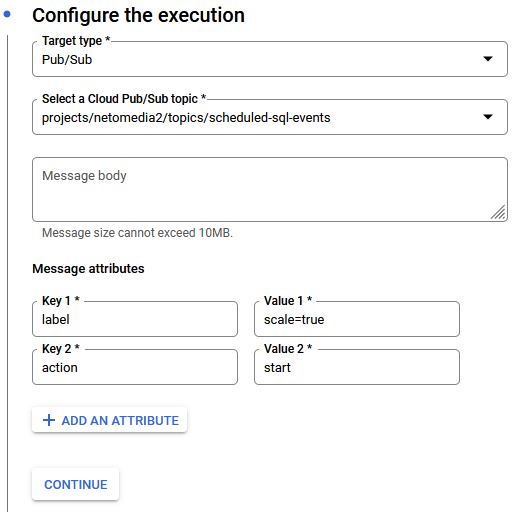

# How to use it

1) Enable **API/Service Details** `sqladmin API (prod)`. This can be done via URL https://console.developers.google.com/apis/api/sqladmin.googleapis.com/overview?project=123456789012 where 123456789012 is the Project number.

2) Create a PUB/SUB Topic

   

3) Create Cloud Function

   

   

   

   Paste the content of [gcp_sql_scheduler.py](./gcp_sql_scheduler/gcp_sql_scheduler.py) into the `main.py` file in the console and change the **Entry point** to `main`

   Paste the content of [requirements.txt](./gcp_sql_scheduler/requirements.txt) into `requirements.txt` file in the console.

   

   Then click the **Deploy** button.

4) Create Cloud Scheduler jobs

   Create two jobs. One for start and Project number another one for stop SQL instances.

   The only difference between these two should be the value on **Key 2**
   For starting the SQL instances, `action` should be `start` and `stop` for stopping.

   The **Key 1** attribute -> Specify here what should be the SQL instance label. All SQL instances with that label will be scheduled.

   

   
