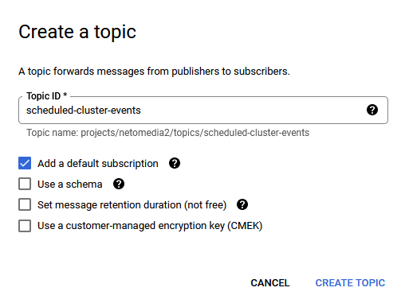
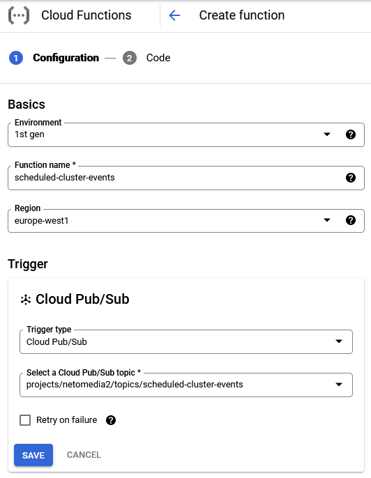
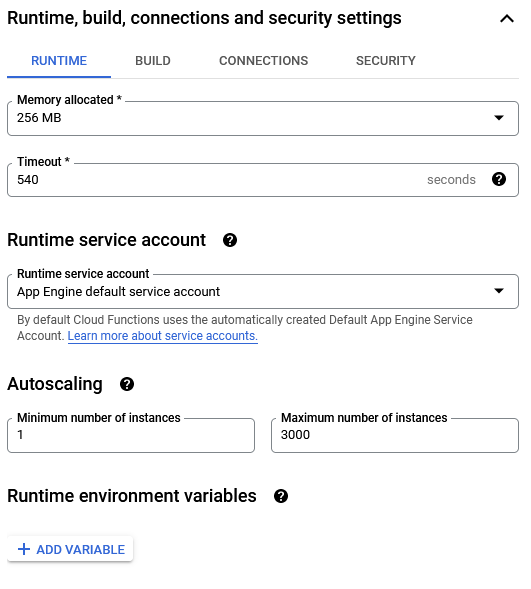
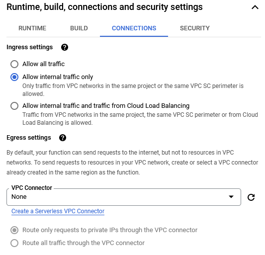
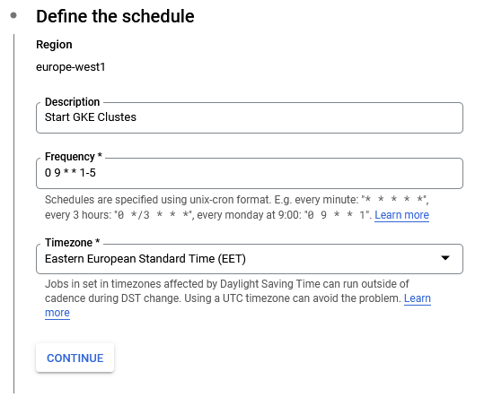
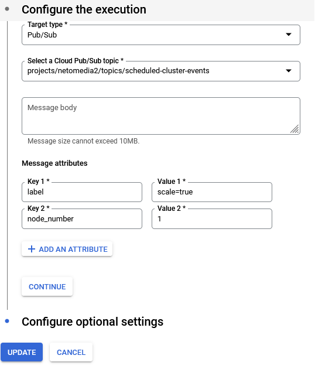

# How to use it

1) Create a PUB/SUB Topic

   

2) Create Cloud Function

   

   

   

3) Create Cloud Scheduler jobs

  Create two jobs. One for start and another one for stop clusters.

  The only difference between these two should be the value on **Key 2**
  For starting the cluster, `node_number` should be `1` or more (depends on how many nodes you want to start)

  The **Key 1** attribute -> Specify here what should be the cluster label. All clusters with that label will be scheduled.

   

   
